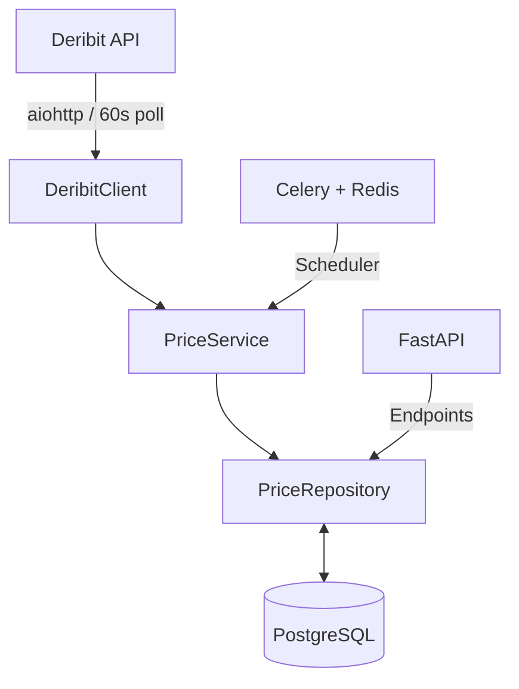

<div align="center">

<div align="right">
  
</div>

# Deribit Price Tracker

**Async index price tracker for BTC/USD and ETH/USD**  
Collects every 60 seconds → PostgreSQL → FastAPI REST API

[](https://www.python.org/)
[](https://fastapi.tiangolo.com/)
[](https://www.postgresql.org/)
[](https://www.docker.com/)
[](LICENSE)

</div>

## Features

- Fully async stack for high performance (FastAPI, aiohttp, Celery, asyncpg)  
- Automated collection of Deribit index prices every 60 seconds  
- Time-series storage in PostgreSQL with efficient querying  
- Built-in interactive docs (Swagger UI and ReDoc)  
- Fault-tolerant: Automatic retries with backoff on API failures  
- Docker Compose for one-command deployment  
- Continues serving cached data during Deribit outages  

## Quickstart

```bash
git clone https://github.com/DECAPITATION770/DernitClient_Api.git
cd DernitClient_Api

cp .env.example .env

docker compose up -d --build
```

After ~60–120 seconds for initial data collection:

- Swagger UI: http://localhost:8000/docs  
- ReDoc: http://localhost:8000/redoc  

## API Endpoints

| Method | Path                            | Description                        | Query Parameters                          |
|--------|---------------------------------|------------------------------------|-------------------------------------------|
| GET    | `/api/v1/prices/latest`         | Latest price                       | `ticker` (BTC_USD \| ETH_USD)             |
| GET    | `/api/v1/prices`                | Last N records                     | `ticker`, `limit` (default: 100)          |
| GET    | `/api/v1/prices/by-date`        | Records in timestamp range         | `ticker`, `date_from`, `date_to`          |

## Examples

```bash
# Latest BTC price
curl -s "http://localhost:8000/api/v1/prices/latest?ticker=BTC_USD" 

# Last 200 ETH records
curl -s "http://localhost:8000/api/v1/prices?ticker=ETH_USD&limit=200" 

# Range query (unix timestamps)
curl -s "http://localhost:8000/api/v1/prices/by-date?ticker=BTC_USD&date_from=1735689600&date_to=1735776000" 
```

## Architecture



## Development

Install dependencies:

```bash
python -m venv .venv
source .venv/bin/activate  # Windows: .venv\Scripts\activate
pip install -r requirements.txt -r requirements-dev.txt
```

Run locally:

```bash
# API
uvicorn app.main:app --reload --port 8000

# Celery worker (separate terminal)
celery -A app.tasks worker --loglevel=info

# Celery beat (separate terminal)
celery -A app.tasks beat --loglevel=info
```

Run tests:

```bash
pytest -v
# Or in Docker
docker compose exec app pytest -v
```

## Tech Stack

- Python 3.11  
- FastAPI + Pydantic v2  
- SQLAlchemy 2.0 + asyncpg  
- aiohttp for API client  
- Celery + Redis for scheduling  
- PostgreSQL for storage  
- Docker Compose for orchestration  
- pytest + pytest-asyncio for testing  
