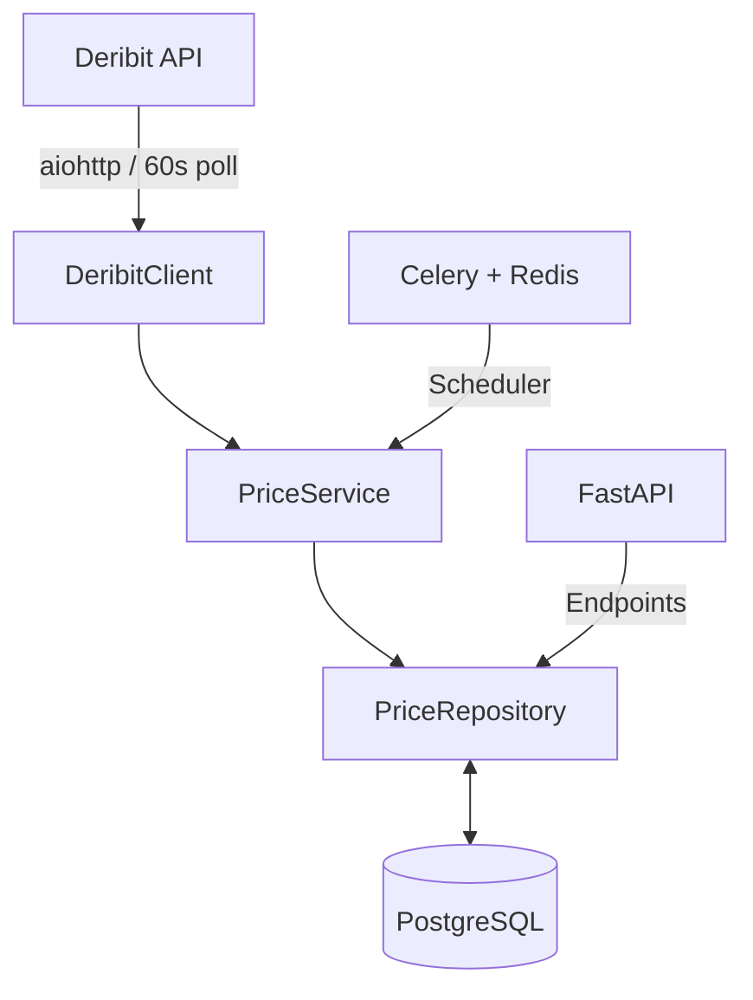

<div align="center">

<div align="right">
  
</div>

# Deribit Price Tracker

**Async index price tracker for BTC/USD and ETH/USD**  
Collects every 60 seconds → PostgreSQL → FastAPI REST API

[](https://www.python.org/)
[](https://fastapi.tiangolo.com/)
[](https://www.postgresql.org/)
[](https://www.docker.com/)
[](LICENSE)

</div>

## Features

- Fully async stack for high performance (FastAPI, aiohttp, Celery, asyncpg)  
- Automated collection of Deribit index prices every 60 seconds  
- Time-series storage in PostgreSQL with efficient querying  
- Built-in interactive docs (Swagger UI and ReDoc)  
- Fault-tolerant: Automatic retries with backoff on API failures  
- Docker Compose for one-command deployment  
- Continues serving cached data during Deribit outages  

## Quickstart

```bash
git clone https://github.com/DECAPITATION770/DernitClient_Api.git
cd DernitClient_Api

cp .env.example .env

docker compose up -d --build
```

- Swagger UI: http://localhost:8000/docs  
- ReDoc: http://localhost:8000/redoc  

## API Endpoints

| Method | Path                            | Description                        | Query Parameters                          |
|--------|---------------------------------|------------------------------------|-------------------------------------------|
| GET    | `/api/v1/prices/latest`         | Latest price                       | `ticker` (BTC_USD \| ETH_USD)             |
| GET    | `/api/v1/prices`                | Last N records                     | `ticker`, `limit` (default: 100)          |
| GET    | `/api/v1/prices/by-date`        | Records in timestamp range         | `ticker`, `date_from`, `date_to`          |

---

## Examples

<details>
<summary><strong>Latest BTC price</strong></summary>
**GET** `/api/v1/prices/latest`

**Description:** Get latest price for ticker

**Query params:**

* `ticker` (required): `BTC_USD | ETH_USD`

**Request**

```bash
curl -s "http://localhost:8000/api/v1/prices/latest?ticker=BTC_USD"
```

**Response 200**

```json
{
  "id": 17,
  "ticker": "BTC_USD",
  "price": 95210.21,
  "timestamp": 1768759313
}
```
___
</details>

<details>
<summary><strong>Last 200 ETH records</strong></summary>

**GET** `/api/v1/prices`

**Description:** Get last N price records

**Query params:**

* `ticker` (required): `ETH_USD`
* `limit` (optional, default 100, max 1000)

**Request**

```bash
curl -s "http://localhost:8000/api/v1/prices?ticker=ETH_USD&limit=200"
```

**Response 200**

```json
[
  {
    "id": 22,
    "ticker": "ETH_USD",
    "price": 3340.56,
    "timestamp": 1768759437
  },
  {
    "id": 20,
    "ticker": "ETH_USD",
    "price": 3338.91,
    "timestamp": 1768759375
  }
]
```
___
</details>


<details>
<summary><strong>Range query (unix timestamps)</strong></summary>

**GET** `/api/v1/prices/by-date`

**Description:** Get prices in timestamp range

**Query params:**

* `ticker` (required): `BTC_USD`
* `date_from` (required): unix timestamp
* `date_to` (required): unix timestamp

**Request**

```bash
curl -s "http://localhost:8000/api/v1/prices/by-date?ticker=BTC_USD&date_from=1735689600&date_to=1735776000"
```

**Response 200**

```json
[
  {
    "id": 11,
    "ticker": "BTC_USD",
    "price": 95185.59,
    "timestamp": 1768759127
  },
  {
    "id": 9,
    "ticker": "BTC_USD",
    "price": 95182.69,
    "timestamp": 1768759065
  }
]
```
</details>

---
## Architecture



Сейчас секция **норм**, но она звучит как «я знаю слова, но не показываю, что думал». Рекрутеру хочется видеть **причину выбора + альтернативы + последствия**. Не эссе, а короткую инженерную логику.

Ниже версия **прокачанная, но без воды**. Можно копировать целиком.

---

## Design Decisions

### FastAPI

Chosen as the API framework due to its async-first nature, high throughput, and automatic OpenAPI generation.
Compared to Flask, FastAPI provides native async support and built-in request validation, which reduces boilerplate and simplifies future API extension.

### Fully async stack

`aiohttp`, `asyncpg`, and SQLAlchemy 2.0 async are used end-to-end to avoid blocking I/O during frequent price polling and database writes.
This design allows the service to scale predictably under increasing request load without introducing additional worker processes.

### Celery + Redis

Background price collection is separated from the API layer to keep request handling fast and resilient.

* **Celery Beat** is used for deterministic periodic scheduling (every 60 seconds)
* **Redis** is used as a lightweight and reliable message broker

This approach avoids running polling logic inside the API process and ensures price collection continues independently of API traffic.

### PostgreSQL

PostgreSQL was chosen for its reliability and strong support for time-based queries.
The schema and indexes are optimized for querying by `(ticker, timestamp)`, which matches the most common access patterns (latest price, range queries, last N records).

### Docker Compose

Docker Compose provides a reproducible, one-command setup for the entire stack (API, worker, scheduler, database, Redis).
This simplifies local development and ensures reviewers can run the project without manual environment configuration.

### Fault tolerance

Retry logic with exponential backoff is implemented for Deribit API calls to handle temporary network issues and rate limits.
In case of upstream API outages, the system continues serving previously collected data from the database, ensuring read availability.

---
## Development

Install dependencies:

```bash
python -m venv .venv
source .venv/bin/activate  # Windows: .venv\Scripts\activate
pip install -r requirements.txt -r requirements-dev.txt
```

Run locally:

```bash
# API
uvicorn app.main:app --reload --port 8000

# Celery worker (separate terminal)
celery -A app.tasks worker --loglevel=info

# Celery beat (separate terminal)
celery -A app.tasks beat --loglevel=info
```

Run tests:

```bash
pytest -v
# Or in Docker
docker compose exec app pytest -v
```

## Tech Stack

- Python 3.11  
- FastAPI + Pydantic v2  
- SQLAlchemy 2.0 + asyncpg  
- aiohttp for API client  
- Celery + Redis for scheduling  
- PostgreSQL for storage  
- Docker Compose for orchestration  
- pytest + pytest-asyncio for testing  
