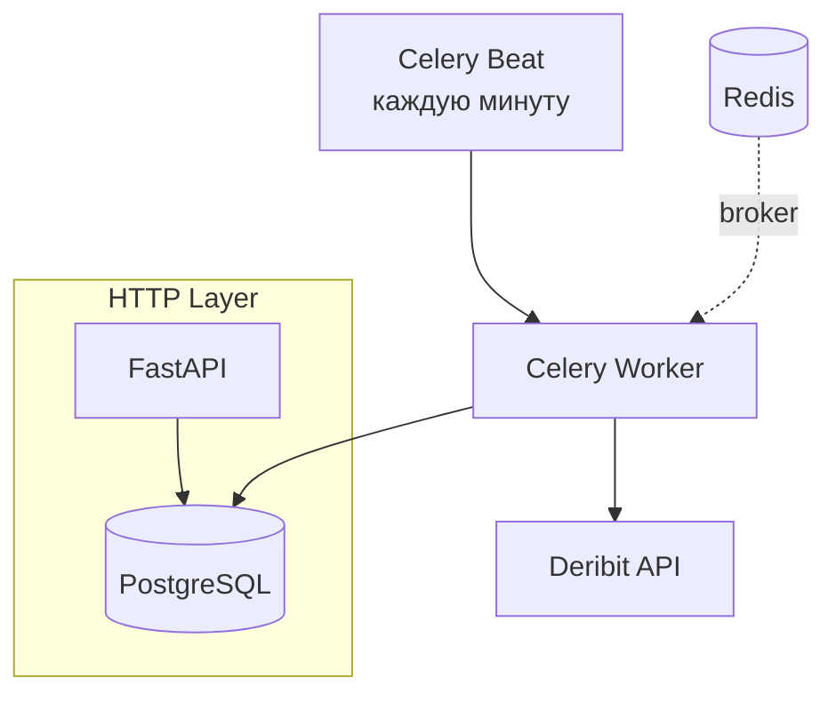

# Deribit Index Price Tracker


**Асинхронный сервис**, который **каждую минуту** получает **index price** BTC/USD и ETH/USD с Deribit (v2 API) и сохраняет их в PostgreSQL.

## Почему стоит посмотреть

- Полностью асинхронный стек (FastAPI + aiohttp + asyncpg)
- Celery + Redis + Celery Beat — надёжные задачи с ретраями
- Graceful shutdown и health-check эндпоинт `/health`
- Rate-limit friendly запросы к Deribit
- Чистое разделение слоёв (Client → Service → Repository)
- Полные тесты (моки + интеграционные)
- Всё поднимается одной командой через Docker Compose

## Архитектура

### Логический поток

```mermaid
flowchart LR
    A[Deribit API v2] --> B[DeribitClient (aiohttp)]
    B --> C[PriceService (бизнес-логика)]
    C --> D[PriceRepository (asyncpg)]
    D --> E[(PostgreSQL)]
```

### Запуск и исполнение



Сбор данных **не блокирует** API → можно спокойно масштабировать воркеры и API независимо.

## Технологии

- **Python 3.11** — type hints, match-case, улучшенная производительность
- **FastAPI** — асинхронный API + автоматическая OpenAPI-документация
- **Celery + Redis** — фоновые задачи, retry, beat schedule
- **aiohttp** — быстрый асинхронный HTTP-клиент для Deribit
- **asyncpg** — быстрый PostgreSQL-драйвер
- **PostgreSQL** — time-series данные
- **Docker + Compose** — всё в контейнерах
- **pytest + pytest-asyncio** — тесты

## Быстрый старт

```bash
git clone https://github.com/DECAPITATION770/DernitClient_Api.git
cd DernitClient_Api

cp .env.example .env

docker compose up -d --build
```

**Swagger / ReDoc**:  
http://localhost:8000/docs  
http://localhost:8000/redoc

## API (v1)

Все эндпоинты: `/api/v1/...`

| Метод | Путь                        | Описание                  | Параметры                              |
|-------|-----------------------------|---------------------------|----------------------------------------|
| GET   | `/prices`                   | История цен (последние)   | `ticker` (BTC_USD \| ETH_USD), `limit` (≤1000) |
| GET   | `/prices/latest`            | Самая свежая цена         | `ticker`                               |
| GET   | `/prices/by-date`           | Цены за диапазон          | `ticker`, `date_from`, `date_to` (unix seconds) |

Пример ответа `/prices/latest?ticker=BTC_USD`:

```json
{
  "id": 42,
  "ticker": "BTC_USD",
  "price": 95874.50,
  "timestamp": 1737219840
}
```

**Ошибки**:

- 400 — неверные параметры
- 404 — нет данных по тикеру
- 503 — сервис временно недоступен (например, нет свежих данных)
---
## Тестирование

```bash
# Внутри контейнера
docker compose exec app pytest -v

# Или локально (после poetry/venv)
pytest -v
```

Покрыто:

- DeribitClient (httpx mock)
- PriceService
- Repository (in-memory + asyncpg тесты)
- API эндпоинты (TestClient)
